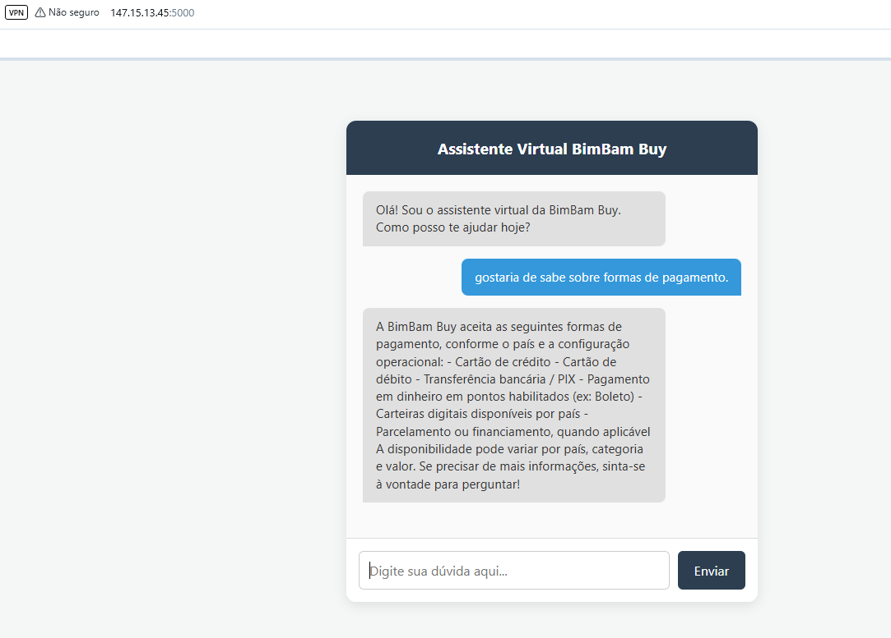
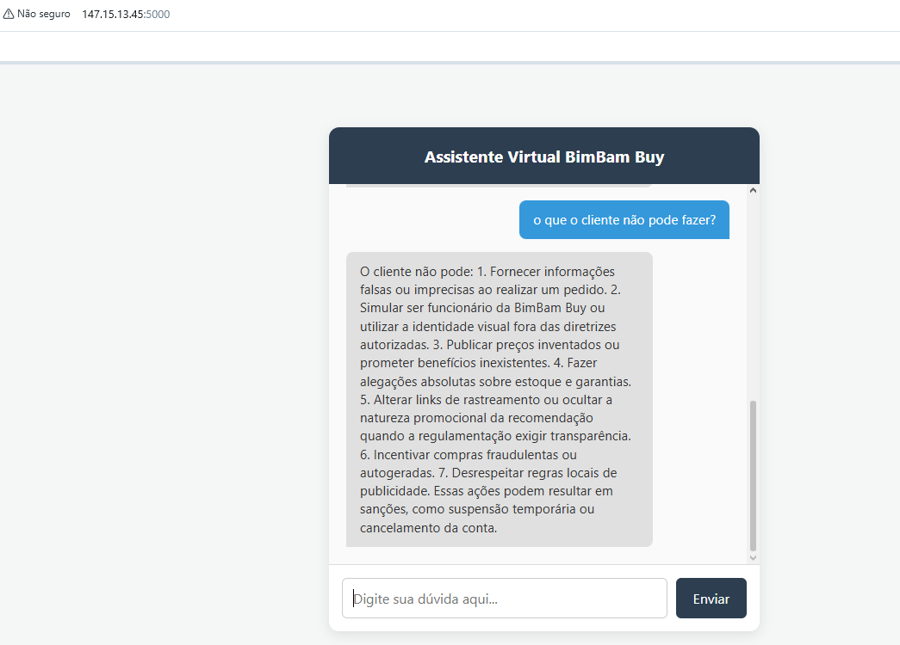
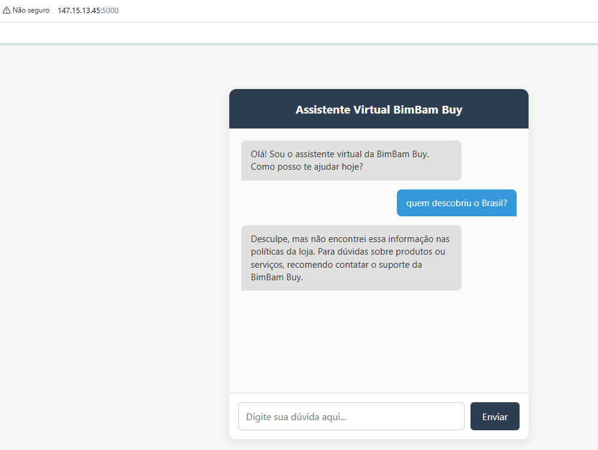
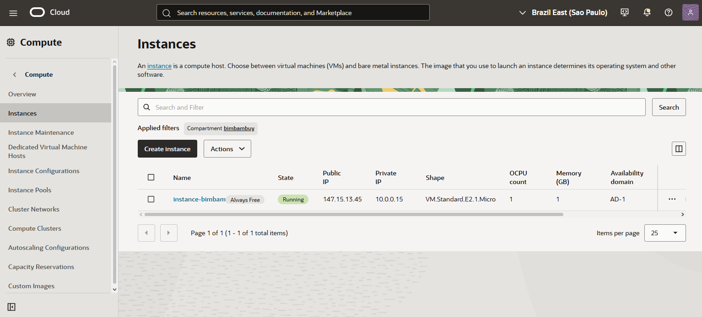

# BimBam Buy

O BimBam Buy é um assistente virtual em Flask para responder perguntas com base em documentos da loja, usando uma abordagem RAG (Retrieval-Augmented Generation). A aplicação lê arquivos da pasta documentos, extrai texto e tenta responder com contexto relevante, usando modelos externos como Gemini ou OpenAI quando as chaves estão disponíveis, ou um fallback local quando não estão.

## O que a aplicação faz

- Lê arquivos em diferentes formatos:
  - TXT
  - CSV
  - PDF
  - DOCX 
- Carrega esses arquivos para formar a base de conhecimento do projeto.
- Recupera trechos relevantes para a pergunta do usuário.
- Gera respostas com base no contexto recuperado.
- Expõe uma interface web simples para interação.

## Estrutura do projeto

```text
bimbambuy/
├── app.py
├── Dockerfile
├── requirements.txt
├── templates/
│   └── index.html
├── documentos/
├── tests/
├── README.md
└── .env
```

## Requisitos

- Python 3.9 ou superior
- Ambiente virtual recomendado
- Chave de API do Google Gemini ou OpenAI, opcionalmente

## Configuração do ambiente

### 1. Criar e ativar o ambiente virtual

No Windows PowerShell:

```powershell
py -3 -m venv .venv
.\.venv\Scripts\Activate.ps1
```

No Linux/macOS:

```bash
python3 -m venv .venv
source .venv/bin/activate
```

### 2. Instalar dependências

```bash
python -m pip install --upgrade pip
python -m pip install -r requirements.txt
```

Se o comando falhar por problema com o launcher do pip no Windows, use:

```powershell
.\.venv\Scripts\python.exe -m pip install -r requirements.txt
```

### 3. Configurar variáveis de ambiente

Crie um arquivo chamado .env na raiz do projeto com uma das opções abaixo:

```env
GOOGLE_API_KEY=sua_chave_aqui
```

ou

```env
OPENAI_API_KEY=sua_chave_aqui
```

> Se nenhuma chave estiver configurada, a aplicação usa um modo local de fallback para responder com base no contexto disponível.

## Adicionar documentos à base de conhecimento

Coloque os arquivos que devem servir como fonte de resposta na pasta documentos/.

Exemplos aceitos:
- arquivos .txt
- arquivos .csv
- arquivos .pdf
- arquivos .docx 

## Executar a aplicação localmente

```bash
python app.py
```

A aplicação ficará disponível em:

```text
http://127.0.0.1:5000/
```

## Executar com Docker

Construa a imagem:

```bash
docker build -t bimbambuy .
```

Execute o container:

```bash
docker run -p 5000:5000 --env-file .env bimbambuy
```

## Executando no OCI

O projeto também funciona corretamente no Oracle Cloud Infrastructure (OCI). A aplicação pode ser implantada em uma instância Linux com Docker, exposta na porta 5000 e acessada via navegador.

Exemplo de fluxo de execução no OCI:

- Criar ou selecionar uma instância compute no OCI.
- Instalar Docker na máquina.
- Fazer o build da imagem do projeto.
- Publicar o container na porta 5000.
- Acessar a interface pelo endereço público da instância.

Abaixo estão exemplos visuais da interface e do ambiente de execução:






(Se a pergunta não estiver de acordo com a documentação fornecida, o bot não responderá.)


## Testes

Os testes automatizados podem ser executados com:

```bash
python -m unittest discover -s tests -v
```

## Observações importantes

- Se não houver documentos na pasta documentos/, a aplicação não conseguirá montar a base de conhecimento.
- A aplicação pode registrar interações em um arquivo chamado historico_chat.log, dependendo da configuração do ambiente.

## Próximos passos possíveis

- Melhorar a recuperação semântica com reranking.
- Adicionar filtros por metadados e data.
- Implementar autenticação e painel administrativo.
- Preparar a aplicação para deploy em ambiente de produção.
